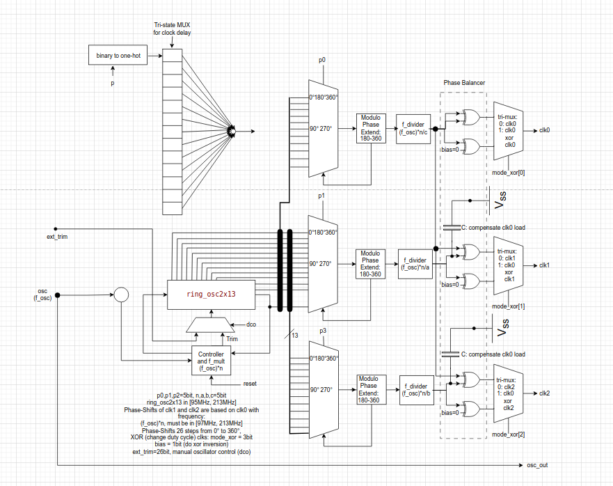

# HeiChips 2025 Hackathon Template

In the Block we implemented four projects:

- A multimode digital PLL with range from 95MHz to 213MHz input clk multiply up to 5 bits and output clk div up to 5 bits. We have 26 Phase shifts from 0deg to 360deg and 3 output clocks that are phase related to each other. Optionally use a DCO mode to have a free running oscillator that bypasses the controller logic. Output clocks can be XORt with each other to be able to change the duty cycle and at max double frequency. Functionallity confirmed with spice, sdf gatelevel and beh. simulations.

- Four custom standard cells 2 to 1 muxes and latches.
- A clock delay line that can delay an input clock this will result in phase shifts.
- An analog to digital converter 

## Multimode digital PLL outline:



## Physical Implementation using LibreLane

To implement the macro of your project, run the following make target, which invokes LibreLane:

```
make macro
```

To view the macro in the OpenROAD GUI:

```
make macro-openroad
```

To view the layout of the macro with KLayout:

```
make macro-klayout
```

## Submission

In order to submit your design for integration into the HeiChips 2025 Tapeout, please open an issue at the following repository: https://github.com/FPGA-Research/heichips25-tapeout/issues

**The submission deadline is August 17, anywhere on earth.**

The issue should contain the following information:

- The name of your group
- The name of your project
- The group members
- The link to your repository

> [!IMPORTANT]
> Your template repository needs to contain the final macro in the `macro/` folder.

Checklist:

- [x] The project top-level has a unique name starting with `heichips25_`.
- [x] The design is verified and tested.
- [x] The macro is stored under `macro/`.
- [x] `TopMetal2` in the macro is empty (for integration).
- [x] The macro is DRC clean (minimal DRC set without fill checks).
- [x] The macro uses the default power pins (VPWR, VGND).
- [x] The project is licensed under Apache 2.0.

## License

The code in this repository is licensed under Apache 2.0.
